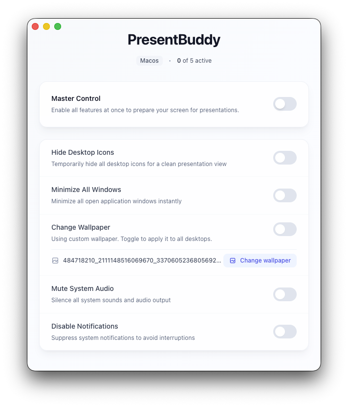

# PresentBuddy

Prepare your screen for professional presentations with one click.



## ✨ Features

- **Hide Desktop Icons** - Temporarily hide desktop icons on Windows/macOS/Linux
- **Minimize All Windows** - Minimize all open applications to taskbar/dock
- **Change Wallpaper** - Switch to a neutral/professional wallpaper
- **Mute System Audio** - Turn off speakers/mute system sound
- **Disable Notifications** - Suppress system notifications during presentations
- **One-Click Toggle** - Single button to enable/disable all features at once
- **Individual Controls** - Toggle each feature independently
- **Auto-Restore** - Automatically restore original settings when app closes

## 🚀 Quick Start

### Installation

#### Windows
1. Download the latest `.exe` installer from [Releases](https://github.com/yourusername/presentbuddy/releases)
2. Run the installer and follow the prompts
3. Launch PresentBuddy from the Start menu

#### macOS
1. Download the latest `.dmg` file from [Releases](https://github.com/yourusername/presentbuddy/releases)
2. Open the DMG file
3. Drag PresentBuddy to your Applications folder
4. Launch from Applications (you may need to allow it in System Preferences > Security)

#### Linux
1. Download the appropriate package for your distribution:
   - `.AppImage` - Universal, just make executable and run
   - `.deb` - For Debian/Ubuntu-based distributions
   - `.rpm` - For Red Hat/Fedora-based distributions
2. Install using your package manager or run the AppImage

### Usage

1. **Launch the application**
2. **Use Master Toggle** - Click the large toggle at the top to enable/disable all features at once
3. **Individual Controls** - Use the smaller toggles to control each feature independently
4. **Auto-Restore** - When you close the app, all settings are automatically restored (if enabled in settings)

## 🛠️ Development

### Prerequisites

- Node.js >= 18.0.0
- npm or yarn

### Setup

```bash
# Clone the repository
git clone https://github.com/yourusername/presentbuddy.git
cd presentbuddy

# Install dependencies
npm install

# Run in development mode
npm run electron:dev
```

### Build

```bash
# Build for current platform
npm run build

# Build for specific platform
npm run build:win    # Windows
npm run build:mac    # macOS
npm run build:linux  # Linux
```

### Project Structure

```
presentbuddy/
├── src/
│   ├── main/              # Electron main process
│   │   ├── index.ts       # Main entry point
│   │   ├── window.ts      # Window management
│   │   ├── storage.ts     # State persistence
│   │   └── platform/      # Platform-specific implementations
│   │       ├── windows.ts
│   │       ├── macos.ts
│   │       └── linux.ts
│   ├── renderer/          # React frontend
│   │   ├── App.tsx
│   │   ├── components/    # UI components
│   │   └── hooks/         # React hooks
│   ├── preload/           # Preload scripts
│   └── shared/            # Shared types and constants
├── assets/                # Icons and wallpapers
└── dist/                  # Build output
```

## 🔧 Platform-Specific Notes

### Windows
- Some features may require administrator privileges
- Desktop icon hiding uses Windows Registry
- Wallpaper changes use Windows API

### macOS
- Some features require accessibility permissions
- Desktop icon hiding uses Finder preferences
- Do Not Disturb mode for notifications

### Linux
- Supports GNOME, KDE, and XFCE desktop environments
- May require additional packages (wmctrl, xdotool, etc.)
- Audio control uses PulseAudio or ALSA

## 📋 Requirements

- **Windows**: Windows 10 or later
- **macOS**: macOS 10.15 (Catalina) or later
- **Linux**: Modern distribution with GNOME, KDE, or XFCE

## 🤝 Contributing

Contributions are welcome! Please see [CONTRIBUTING.md](CONTRIBUTING.md) for guidelines.

1. Fork the repository
2. Create your feature branch (`git checkout -b feature/amazing-feature`)
3. Commit your changes (`git commit -m 'Add some amazing feature'`)
4. Push to the branch (`git push origin feature/amazing-feature`)
5. Open a Pull Request

## 📝 License

This project is licensed under the MIT License - see the [LICENSE](LICENSE) file for details.

## 🙏 Acknowledgments

- Built with [Electron](https://www.electronjs.org/)
- UI built with [React](https://react.dev/) and [Tailwind CSS](https://tailwindcss.com/)

## ⚠️ Disclaimer

This application modifies system settings. While it includes auto-restore functionality, please use at your own risk. The developers are not responsible for any issues that may arise from using this software.

## 📞 Support

- **Issues**: [GitHub Issues](https://github.com/yourusername/presentbuddy/issues)
- **Discussions**: [GitHub Discussions](https://github.com/yourusername/presentbuddy/discussions)

---

Made with ❤️ by the open-source community

